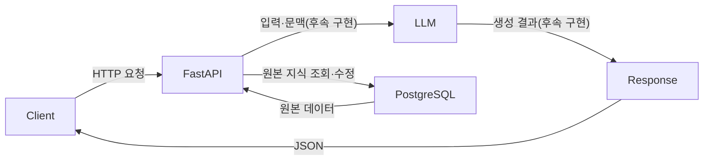

# AI 지식 플랫폼 개념도

```mermaid
flowchart LR
  N0["Client"]
  N1["FastAPI"]
  N2["LLM"]
  N3["PostgreSQL"]
  N4["Response"]
  N0 -->|"HTTP 요청"| N1
  N1 -->|"원본 지식 조회·수정"| N3
  N3 -->|"원본 데이터"| N1
  N1 -->|"입력·문맥(후속 구현)"| N2
  N2 -->|"생성 결과(후속 구현)"| N4
  N4 -->|"JSON"| N0
```
